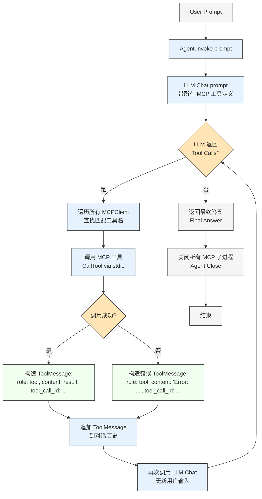

# Genie1.0--

### 基于GO语言实现的安卓自动化测试项目，此项目即将完成

灵感来源于：Genie,一个安卓自动化测试项目，本项目在此基础上进行改进[Genie](https://github.com/functional-fuzzing-android-apps/home)
本仓库中的Genie0.0.md文件中包含了对原项目整体代码的分析，具体部署方式见该文档即可，本项目启动方式与其前几步一致：需要先连接到安卓设备

### 项目介绍：

本项目包含大量的api，使用RAG构建知识库，内置agent可以根据输入的命令自动生成调用相关api的脚本进行测试，并输出测试结果，通过opencv、yolo等智能方式判断是否存在缺陷
支持自定义api进行测试，会自动将新的api加入知识库，具体使用方式见agent目录下的markdown文件或者下方的描述，核心文件是：opencv、agent、examples等

该项目文件较多，总体分为三个部分：

①go语言实现的所有api(包括openCV调用、yolo检测等)；

②一个go语言实现的简易llm-mcp-rag模型：帮助理解项目内置的agent实现逻辑；

③项目内置的agent，已接入大模型，可根据用户输入自动进行测试脚本的生成并且调用相应的api生成测试报告。

可根据下方流程进行阅读，每个部分都有相应的文档说明，只需要连接到安卓设备即可，启动命令已内置到api中，直接调用即可，具体api可询问内部大模型，或者参考文件中的注释，简单易懂

**第一部分**

**缺少一个api目录，此目录单独上传到了仓库：[openCV](https://github.com/xiaocainiao633/openCV/tree/main)，其他所有api目录如下：**

```
Genie1.0--/
├── app          # 应用相关API文件目录
├── console      # 控制台功能API文件目
├── device       # 设备相关API文件目录
├── files        # 文件相关API文件目录
├── https        # 网络请求相关API文件目录
├── images       # 图片资源API文件目录
├── ime          # 输入法相关API文件目录
├── imgui        # ImGui界面相关API文件目录
├── libs         # 依赖库文件目录
├── media        # 媒体资源相关API文件目录
├── motion       # 动效相关API文件目录
├── plugin       # 插件相关API文件目录
├── ppocr        # PPOCR文字识别相关API文件目录
├── rhino        # Rhino服务相关API文件目录
├── storages     # 存储功能相关API文件目录
├── system       # 系统相关API文件目录
├── uiacc        # UI交互相关API文件目录
├── utils        # 工具类相关API文件目录
├── workspace    # 工作区相关API文件目录
└── yolo         # YOLO目标检测相关API文件目录
```

**第二部分：llm-mcp-rag目录下，下方是具体流程图**



**第三部分**

···
agent目录，正在上传中...
···

### 使用方式：

