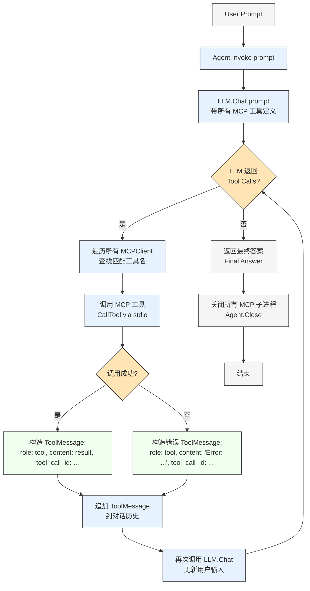
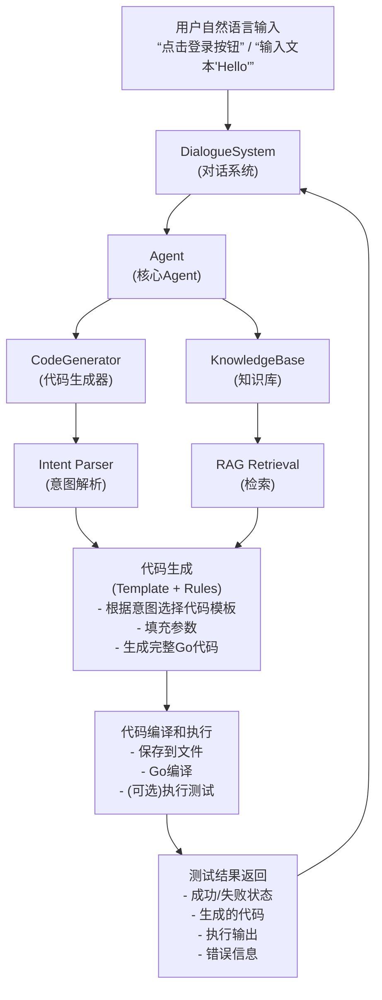

# Genie1.0--

### 一个基于 GO 语言实现的自动化测试 Agent

灵感来源于：Genie,一个安卓自动化测试项目，原项目地址：[Genie](https://github.com/functional-fuzzing-android-apps/home)

本仓库中的 [Genie0.0.md](./Genie0.0.md) 文件中包含了对原项目部分代码的分析，原项目具体部署方式见该文档即可.

另一个文档[对比分析](https://github.com/xiaocainiao633/Genie1.0--/blob/main/%E5%AF%B9%E6%AF%94%E5%88%86%E6%9E%90.md)记录了此项目与原项目的对比，二者实际上属于互补关系，此项目更偏向功能化。

### 项目介绍：

本项目即插即用，是在已有插件基础上改进，包含大量的 api，使用 RAG 构建知识库，agent 可以根据输入的命令自动生成调用相关 api 的脚本进行测试，并输出测试结果，通过 opencv、yolo、ppocr 等智能方式"看到"是否存在缺陷
支持自定义 api ，会自动将新的 api 加入知识库，具体使用方式见最底部的描述，核心文件是：opencv、agent等

该项目文件较多，总体分为三个部分：

①go 语言实现的 api(包括 openCV 调用、yolo 检测等)；

② 一个 go 语言实现的简易 llm-mcp-rag 模型：帮助理解逻辑，与本项目 agent 实现思路一致；

具体api使用可查看[API文档](https://autogo.cc)，在此基础上新增了一些api，可查看注释或底部文档了解。

③ 项目内置的 agent，已接入大模型，可根据用户的输入自动进行测试脚本的生成：[点此查看demo例子](https://github.com/xiaocainiao633/Genie1.0--/blob/main/agent/examples/README.md)并且调用相应的 api 生成测试报告。

可根据下方流程进行阅读，每个部分都有相应的文档说明，只需要连接到安卓设备，启动命令已内置到 api 中，直接调用即可，具体 api 功能可询问内部大模型或者参考文件中的注释，简单易懂

**第一部分**

**缺少一个 api 目录，此目录单独上传到了仓库：[openCV](https://github.com/xiaocainiao633/openCV/tree/main)，其他所有 api 目录如下：**

```
Genie1.0--/
├── app          # 应用相关API文件目录
├── console      # 控制台功能API文件目
├── device       # 设备相关API文件目录
├── files        # 文件相关API文件目录
├── https        # 网络请求相关API文件目录
├── images       # 图片资源API文件目录
├── ime          # 输入法相关API文件目录
├── imgui        # ImGui界面相关API文件目录
├── libs         # 依赖库文件目录
├── media        # 媒体资源相关API文件目录
├── motion       # 动效相关API文件目录
├── plugin       # 插件相关API文件目录
├── ppocr        # PPOCR文字识别相关API文件目录
├── rhino        # Rhino服务相关API文件目录
├── storages     # 存储功能相关API文件目录
├── system       # 系统相关API文件目录
├── uiacc        # UI交互相关API文件目录
├── utils        # 工具类相关API文件目录
├── workspace    # 工作区相关API文件目录
└── yolo         # YOLO目标检测相关API文件目录
```

**第二部分：llm-mcp-rag 目录下，下方是具体流程图**



**第三部分：agent 目录 + main.go 文件 + examples 目录 + test.db + knowledge_base.db**

```
agent/
├── agent.go             # 调度核心（编译/执行/报告）
├── code_generator.go    # 意图解析 + 模板/LLM生成
├── dialogue.go          # 多轮对话系统
├── knowledge_base.go    # SQLite + 向量检索
├── memory.go            # 对话记忆
├── executor.go          # ADB 执行器
├── report.go            # 测试报告
├── ollama_client.go     # Ollama 接入
└── config.go            # 运行配置

Genie1.0--/
├── main.go              # 入口函数
├── examples             # 测试用例要求举例
├── test.db              # 初始化形成的知识库
└── knowledge_base.db    # 初始化形成的知识库
```

**agent 实现流程如下：**



## 具体分析请查看相关文档：

- [ agent 目录概述](./agent/README.md)
- [ agent 使用方式详解](./agent/USAGE_GUIDE.md)
- [ agent 整体架构分析](./agent/ARCHITECTURE.md)
- [ 项目快速开始 ](./agent/QUICK_START.md)
- [ AutoGo API 配合机制与自动化测试指南 ](https://github.com/xiaocainiao633/Genie1.0--/blob/main/AutoGo%20API%20%E9%85%8D%E5%90%88%E6%9C%BA%E5%88%B6%E4%B8%8E%E8%87%AA%E5%8A%A8%E5%8C%96%E6%B5%8B%E8%AF%95%E6%8C%87%E5%8D%97.md)
- [ RAG 系统概述 ](https://github.com/xiaocainiao633/Genie1.0--/blob/main/RAG_SYSTEM_OVERVIEW.md)


